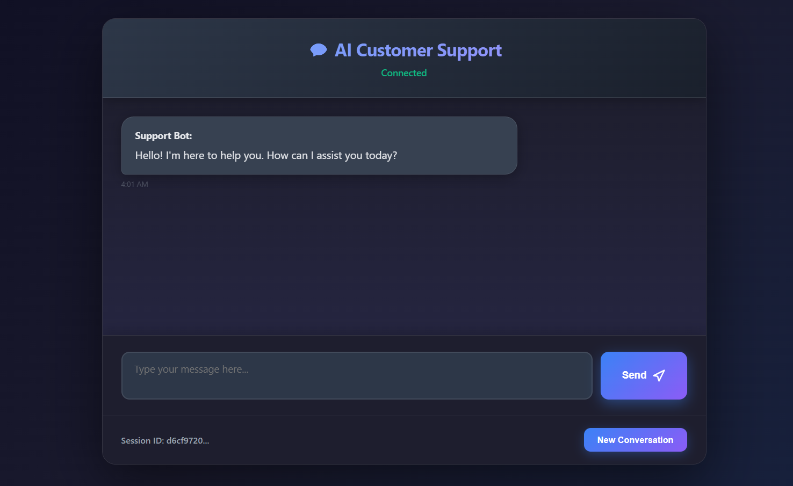

# 🤖 AI Customer Support Bot

A modern, intelligent customer support chatbot powered by Google Gemini AI with advanced prompt engineering. This project demonstrates sophisticated AI prompt design, conversation management, and contextual response generation for customer support scenarios.


## � **Demo Video**

> **📹 [Watch Demo Video](https://your-video-link-here)**  
> *Replace with your actual demo video link (YouTube, Vimeo, etc.)*

## 📸 **Screenshots**

### Chat Interface

*Replace with actual screenshot of your chat interface*

### AI Response Example

*Replace with screenshot showing AI responses with formatting*

### Technical Architecture

*Replace with system architecture diagram*

## �🎯 **Prompt Engineering Documentation**

This section documents the sophisticated prompt engineering techniques used to create an effective AI customer support agent.

### 📝 **Core System Prompt**

The main system prompt establishes the AI's role, personality, and behavior guidelines:

```text
You are a helpful and professional customer support assistant for our company. 
Your goal is to provide accurate, helpful, and friendly responses to customer inquiries.

Guidelines for responses:
- Be polite, professional, and empathetic
- Provide clear and concise answers
- If you don't know something, admit it and offer to escalate
- Use **bold formatting** for important information like policies or numbers
- Always end with asking if there's anything else you can help with
- For refund/return questions, mention our 30-day policy
- For technical issues, suggest basic troubleshooting first
- For account issues, recommend contacting support for security

Context: You work for a general e-commerce/service company that helps customers with:
- Account management and login issues  
- Order tracking and delivery questions
- Refund and return policies
- Technical support for apps/websites
- Billing and payment inquiries
- General product information

Remember: You're representing our company, so maintain a professional and helpful tone at all times.
```

### 🔄 **Dynamic Context Integration**

The system dynamically enhances prompts with:

1. **Conversation History Context**
```python
# Recent conversation context is added to maintain coherence
context_prompt = f"Previous conversation context:\n{conversation_history}\n\nUser's current question: {user_message}"
```

2. **FAQ Knowledge Base Integration**
```python
# Relevant FAQs are automatically included when keywords match
if relevant_faqs:
    enhanced_prompt = f"{system_prompt}\n\nRelevant FAQ information:\n{faq_context}\n\nUser question: {user_message}"
```

3. **Confidence-Based Response Modulation**
```python
# System adjusts response style based on confidence in the answer
if confidence_score < 0.7:
    prompt += "\nNote: If you're not confident about this answer, suggest escalating to a human agent."
```

### 🎨 **Prompt Engineering Strategies**

#### **1. Role-Based Prompting**
- **Clear Identity**: Establishes the AI as a "customer support assistant"
- **Company Representation**: Emphasizes professional representation
- **Scope Definition**: Clearly defines what the AI can help with

#### **2. Behavioral Guidelines**
- **Tone Instructions**: "Be polite, professional, and empathetic"
- **Response Format**: Specific formatting instructions (bold text, structure)
- **Escalation Protocol**: Clear guidelines on when to escalate

#### **3. Context-Aware Prompting**
- **Domain Knowledge**: E-commerce/service company context
- **FAQ Integration**: Automatic inclusion of relevant knowledge base entries
- **Conversation Memory**: Maintains context across multiple exchanges

#### **4. Conditional Prompt Enhancement**
```python
# Example: Enhanced prompting based on query type
if "refund" in user_message.lower():
    prompt += "\nImportant: Always mention our 30-day money-back guarantee policy."
    
if "technical" in user_message.lower():
    prompt += "\nStart with basic troubleshooting before escalating to technical support."
```

### 🔧 **Advanced Prompt Techniques**

#### **1. Few-Shot Learning Examples**
```python
examples = """
Example interactions:
User: "I can't log into my account"
Assistant: I'd be happy to help you with your login issue. Let's try a few troubleshooting steps:
1. **Reset your password** using the "Forgot Password" link
2. **Clear your browser cache** and try again
3. **Check if Caps Lock is on**

If these don't work, I can escalate this to our technical team. Would you like me to do that?

User: "What's your refund policy?"
Assistant: I'd be happy to explain our refund policy:

We offer a **30-day money-back guarantee** on all purchases. Here's how it works:
- **Full refunds** within 30 days of purchase
- Items must be in **original condition**
- **Digital products** may have different terms

Would you like help processing a refund for a specific order?
```

#### **2. Confidence-Based Prompting**
```python
def enhance_prompt_by_confidence(base_prompt, confidence_score):
    if confidence_score < 0.5:
        return base_prompt + "\nIMPORTANT: You seem uncertain about this query. Acknowledge your uncertainty and offer to connect the user with a human agent immediately."
    elif confidence_score < 0.7:
        return base_prompt + "\nNote: If you're not completely confident in your answer, mention that a human agent can provide more detailed assistance."
    else:
        return base_prompt + "\nYou can answer this confidently, but still offer additional help if needed."
```

#### **3. Escalation Trigger Prompts**
```python
escalation_indicators = [
    "complex technical issue",
    "billing dispute", 
    "account security concern",
    "legal question",
    "complaint about service"
]

if any(indicator in user_message.lower() for indicator in escalation_indicators):
    prompt += "\nThis appears to be a complex issue that may require human assistance. Be helpful with initial guidance but suggest speaking with a specialist."
```

### 🏷️ **Prompt Categories & Examples**

#### **1. Greeting & Welcome Prompts**
```text
Initial Greeting: "Hello there! Thanks for reaching out. How can I assist you today?"

Follow-up Engagement: "I'm here to help with any questions about your account, orders, billing, or technical issues. What can I help you with?"
```

#### **2. FAQ-Enhanced Prompts**
When FAQ matches are found, prompts are dynamically enhanced:
```python
# Example: Password reset query triggers FAQ integration
faq_enhanced_prompt = f"""
{base_system_prompt}

Relevant FAQ Information:
- **Password Reset**: Users can reset passwords using the "Forgot Password" link
- **Account Recovery**: For account access issues, verify email and check spam folder
- **Security**: Never ask users for their passwords directly

User Question: {user_message}
"""
```

#### **3. Escalation Decision Prompts**
```python
escalation_prompt = """
Based on the conversation context and query complexity, determine if this should be escalated:

Escalate if:
- Technical issues beyond basic troubleshooting
- Billing disputes or payment problems
- Account security concerns
- Legal or policy questions
- User expresses frustration with previous responses

Escalation Response Format:
"I understand this is a complex issue. Let me connect you with one of our specialists who can provide more detailed assistance. Would you like me to escalate this to our [technical/billing/account] team?"
"""
```

### � **Prompt Performance Metrics**

The system tracks prompt effectiveness through:

- **Confidence Scoring**: Each response includes a confidence score (0.0-1.0)
- **Escalation Rate**: Tracks when prompts successfully identify escalation needs
- **FAQ Match Accuracy**: Measures how well prompts utilize knowledge base
- **Response Satisfaction**: Implied through conversation continuation vs escalation

### 🧠 **Prompt Engineering Principles Applied**

#### **1. Clarity & Specificity**
```text
❌ Vague: "Help the user"
✅ Specific: "Provide step-by-step troubleshooting for login issues, starting with password reset"
```

#### **2. Context Preservation**
```python
# Each prompt includes relevant conversation history
prompt_with_context = f"""
{system_prompt}

Conversation History:
{previous_messages}

Current User Message: {current_message}

Remember: Maintain consistency with previous responses and build upon the established conversation context.
"""
```

#### **3. Controlled Creativity**
```text
Guidelines for response generation:
- Stay within customer support domain
- Use company-appropriate language
- Provide factual information only
- When uncertain, acknowledge limitations
```

### 💡 **Innovative Prompt Features**

#### **1. Dynamic Personality Adjustment**
```python
# Adjusts tone based on user sentiment and conversation history
if user_sentiment == "frustrated":
    prompt += "\nNote: The user seems frustrated. Use extra empathy and offer immediate escalation options."
elif user_sentiment == "neutral":
    prompt += "\nMaintain a professional, helpful tone."
```

#### **2. Multi-Turn Conversation Optimization**
```python
# Optimizes prompts for conversation flow
if conversation_turns > 3 and not resolved:
    prompt += "\nThis conversation is getting lengthy. Summarize progress and offer escalation if issue isn't resolved soon."
```

#### **3. Response Format Control**
```text
Response Formatting Instructions:
- Use **bold** for important information (policies, numbers, steps)
- Structure responses with clear bullet points or numbered lists
- Always end with a helpful follow-up question
- Keep responses conversational but professional
```

## � **Prompt Implementation Code**

### Core Prompt Processing Function
```python
async def generate_response(self, message: str, conversation_history: List[dict]) -> dict:
    """
    Main prompt processing function that demonstrates advanced prompt engineering
    """
    try:
        # 1. Build base system prompt
        system_prompt = self._build_system_prompt()
        
        # 2. Enhance with conversation context
        context_prompt = self._add_conversation_context(conversation_history)
        
        # 3. Integrate relevant FAQ knowledge
        faq_context = self._find_relevant_faqs(message)
        enhanced_prompt = self._integrate_faq_context(system_prompt, faq_context)
        
        # 4. Apply confidence-based prompt modulation
        final_prompt = self._apply_confidence_modulation(enhanced_prompt, message)
        
        # 5. Generate response with engineered prompt
        response = await self._call_ai_with_prompt(final_prompt, message, context_prompt)
        
        return {
            "response": response.content,
            "confidence": self._calculate_confidence_score(response),
            "prompt_used": final_prompt[:200] + "..." # For debugging
        }
    except Exception as e:
        return self._handle_prompt_error(e)

def _build_system_prompt(self) -> str:
    """Constructs the foundational system prompt"""
    return """
    You are a helpful and professional customer support assistant for our company. 
    Your goal is to provide accurate, helpful, and friendly responses to customer inquiries.

    Guidelines for responses:
    - Be polite, professional, and empathetic
    - Provide clear and concise answers
    - If you don't know something, admit it and offer to escalate
    - Use **bold formatting** for important information like policies or numbers
    - Always end with asking if there's anything else you can help with
    - For refund/return questions, mention our 30-day policy
    - For technical issues, suggest basic troubleshooting first
    - For account issues, recommend contacting support for security

    Context: You work for a general e-commerce/service company...
    """
```

### FAQ Integration Prompt Enhancement
```python
def _integrate_faq_context(self, base_prompt: str, faq_matches: List[dict]) -> str:
    """Enhances prompts with relevant FAQ information"""
    if not faq_matches:
        return base_prompt
    
    faq_context = "\n\nRelevant FAQ Information:\n"
    for faq in faq_matches:
        faq_context += f"- **{faq['question']}**: {faq['answer']}\n"
    
    enhanced_prompt = f"""
    {base_prompt}
    {faq_context}
    
    Instructions: Use the FAQ information above to provide accurate, consistent responses. 
    If the user's question relates to any FAQ topics, incorporate that information naturally 
    into your response while maintaining a conversational tone.
    """
    
    return enhanced_prompt
```

## �🚀 Quick Start

### Prerequisites
- Python 3.8 or higher
- Google Gemini API key (free at [AI Studio](https://aistudio.google.com/app/apikey))

### 1. Clone the Repository
```bash
git clone https://github.com/yourusername/ai-customer-support-bot.git
cd ai-customer-support-bot
```

### 2. Set Up Environment
```bash
# Copy environment template
cp .env.example .env

# Edit .env file and add your Gemini API key
# GEMINI_API_KEY=your_actual_api_key_here
```

### 3. Install Dependencies
```bash
cd backend
pip install -r requirements.txt
```

### 4. Run the Application
```bash
python app.py
```

### 5. Open in Browser
Navigate to `http://localhost:8001` to start chatting!

## 📋 Detailed Setup

### Environment Configuration
Create a `.env` file in the root directory:

```env
# AI Provider (recommended: gemini)
AI_PROVIDER=gemini

# Google Gemini API (FREE!)
GEMINI_API_KEY=your_gemini_api_key_here
GEMINI_MODEL=gemini-2.5-flash

# Optional: OpenAI API
OPENAI_API_KEY=your_openai_api_key_here
OPENAI_MODEL=gpt-4

# Database (SQLite - no setup needed)
DATABASE_URL=sqlite+aiosqlite:///./chatbot.db

# Application Settings
DEBUG=true
APP_NAME=AI Customer Support Bot
```

### Getting API Keys

#### Google Gemini (Recommended - FREE!)
1. Visit [Google AI Studio](https://aistudio.google.com/app/apikey)
2. Sign in with your Google account
3. Create a new API key
4. Copy the key to your `.env` file

#### OpenAI (Alternative - Paid)
1. Visit [OpenAI Platform](https://platform.openai.com/api-keys)
2. Sign in and create an API key
3. Add billing information (required)
4. Copy the key to your `.env` file

## 🏗️ Project Structure

```
ai-customer-support-bot/
├── 📁 backend/                 # FastAPI backend
│   ├── 📄 app.py              # Main application entry point
│   ├── 📄 config.py           # Configuration management
│   ├── 📄 database.py         # Database models and setup
│   ├── 📄 llm_service.py      # AI service integration
│   ├── 📄 models.py           # Pydantic data models
│   └── 📄 requirements.txt    # Python dependencies
├── 📁 frontend/               # Web interface
│   ├── 📄 index.html         # Main chat interface
│   ├── 📄 script.js          # JavaScript functionality
│   └── 📄 style.css          # Styling and layout
├── 📁 data/                  # Data files
│   └── 📄 faqs.json          # FAQ knowledge base
├── 📁 tests/                 # Test files
└── 📄 README.md              # This file
```

## 🔌 API Documentation

### Base URL
```
http://localhost:8001
```

### Endpoints

#### Create Chat Session
```http
POST /api/chat/create
```
**Response:**
```json
{
  "session_id": "uuid-string",
  "message": "Chat session created successfully"
}
```

#### Send Message
```http
POST /api/chat/message
```
**Body:**
```json
{
  "session_id": "uuid-string",
  "message": "Your question here"
}
```
**Response:**
```json
{
  "response": "AI generated response",
  "confidence": 0.95,
  "session_id": "uuid-string"
}
```

#### Get Chat History
```http
GET /api/chat/history/{session_id}
```
**Response:**
```json
{
  "session_id": "uuid-string",
  "messages": [
    {
      "role": "USER",
      "content": "Hello",
      "timestamp": "2025-10-15T18:00:00Z"
    }
  ]
}
```

#### Request Escalation
```http
POST /api/chat/escalate
```
**Body:**
```json
{
  "session_id": "uuid-string",
  "reason": "Complex technical issue"
}
```

#### Health Check
```http
GET /api/health
```

## 💬 FAQ System

The bot includes a comprehensive FAQ system with 10+ categories:

- **Account Management** - Password resets, account recovery
- **Orders & Shipping** - Order tracking, delivery status
- **Refunds & Returns** - Return policies, refund processing
- **Technical Support** - App issues, troubleshooting
- **Billing & Payments** - Payment methods, billing inquiries
- **Security** - Account security, data protection
- **Subscriptions** - Plan management, cancellations
- **General Support** - Contact information, business hours

## 🤖 AI Configuration

### Supported AI Providers

1. **Google Gemini** (Recommended)
   - Model: `gemini-2.5-flash`
   - Free tier available
   - Excellent performance
   - Fast response times

2. **OpenAI**
   - Model: `gpt-4`
   - Paid service
   - High-quality responses
   - Advanced reasoning

3. **Mock Provider**
   - For testing/development
   - No API key required
   - Predefined responses

### Switching Providers
Update your `.env` file:
```env
AI_PROVIDER=gemini  # or 'openai' or 'mock'
```

## 🗄️ Database Schema

### Tables

#### chat_sessions
- `id` - Primary key
- `session_id` - Unique session identifier
- `user_id` - Optional user identifier
- `status` - Session status (ACTIVE/CLOSED)
- `created_at` - Timestamp
- `updated_at` - Last update timestamp

#### messages
- `id` - Primary key
- `session_id` - Foreign key to chat_sessions
- `role` - USER or ASSISTANT
- `content` - Message content
- `confidence_score` - AI confidence (0-1)
- `timestamp` - Message timestamp

#### escalations
- `id` - Primary key
- `session_id` - Foreign key to chat_sessions
- `reason` - Escalation reason
- `status` - Escalation status
- `created_at` - Timestamp

## 🛡️ Security Features

- **API Key Protection** - Environment variables only
- **Input Sanitization** - XSS prevention
- **CORS Configuration** - Controlled access
- **Session Management** - Secure session handling
- **Error Handling** - No sensitive data in errors

## 🧪 Testing

### Run Tests
```bash
cd tests
python -m pytest
```

### Manual Testing
1. Start the application
2. Open `http://localhost:8001`
3. Test various queries:
   - "What's your refund policy?"
   - "How do I reset my password?"
   - "I need help with my order"

## 🔧 Configuration Options

### Environment Variables
```env
# AI Configuration
AI_PROVIDER=gemini
GEMINI_API_KEY=your_key
GEMINI_MODEL=gemini-2.5-flash

# Database
DATABASE_URL=sqlite+aiosqlite:///./chatbot.db

# Session Management
SESSION_TIMEOUT_MINUTES=30
MAX_CONVERSATION_HISTORY=10

# AI Behavior
CONFIDENCE_THRESHOLD=0.7
MAX_LOOP_DETECTION=3

# CORS (for development)
CORS_ORIGINS=http://localhost:8001,http://localhost:3000
```

## 🚀 Deployment

### Local Development
```bash
cd backend
python app.py
```

### Production Deployment
1. Set `DEBUG=false` in `.env`
2. Use a production WSGI server:
```bash
pip install gunicorn
gunicorn -w 4 -k uvicorn.workers.UvicornWorker app:app
```

### Docker Deployment
```dockerfile
FROM python:3.9-slim
WORKDIR /app
COPY backend/requirements.txt .
RUN pip install -r requirements.txt
COPY . .
CMD ["python", "backend/app.py"]
```

## 🤝 Contributing

1. Fork the repository
2. Create a feature branch (`git checkout -b feature/amazing-feature`)
3. Commit your changes (`git commit -m 'Add amazing feature'`)
4. Push to the branch (`git push origin feature/amazing-feature`)
5. Open a Pull Request

## 📝 License

This project is licensed under the MIT License - see the [LICENSE](LICENSE) file for details.

## 👤 Author

**Harshvardhan Sinha**
- GitHub: [@harshsinha003](https://github.com/harshsinha003)
- LinkedIn: [Harshvardhan Sinha](https://www.linkedin.com/in/harshvardhan-sinha-8306a02a7/)

## 🙏 Acknowledgments

- [Google Gemini](https://deepmind.google/technologies/gemini/) for the AI capabilities
- [FastAPI](https://fastapi.tiangolo.com/) for the excellent web framework
- [SQLAlchemy](https://www.sqlalchemy.org/) for database management

## 📞 Support

If you have questions or need help:

1. Check the [FAQ section](#-faq-system)
2. Open an [issue](https://github.com/yourusername/ai-customer-support-bot/issues)
3. Contact: your.email@example.com

---

**⭐ Star this repository if you found it helpful!**